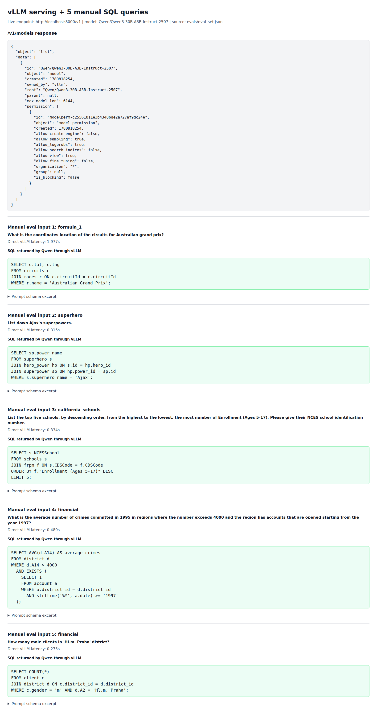
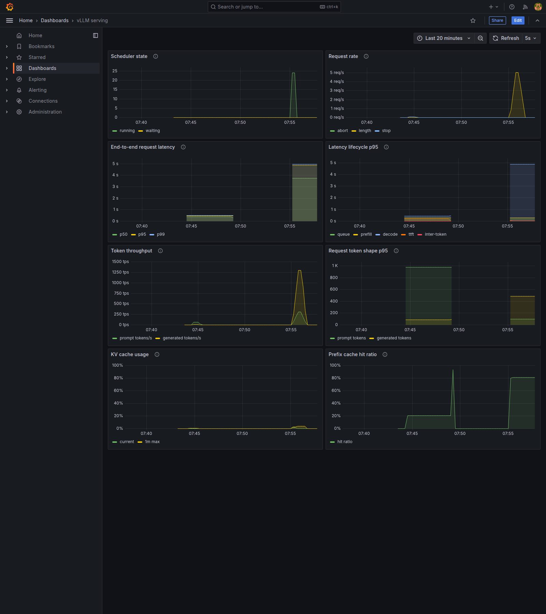
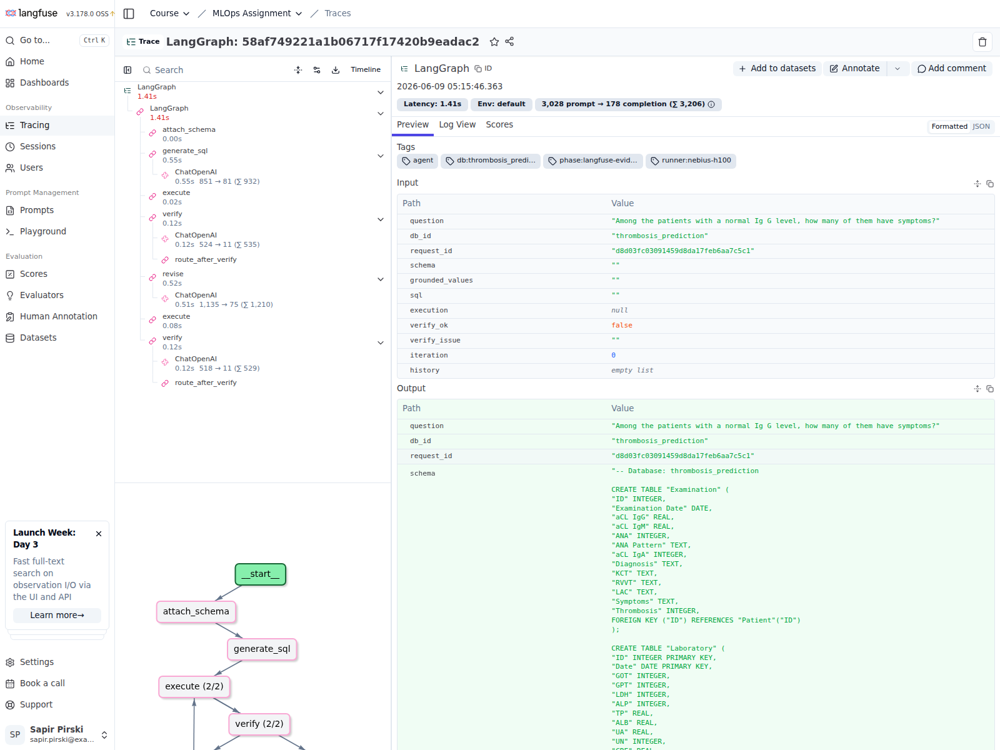
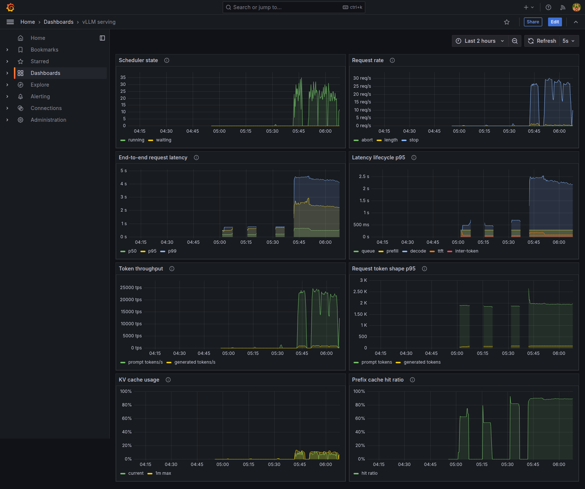

# Text-to-SQL on One H100

An end-to-end MLOps proof of concept for private text-to-SQL: local Qwen
inference with vLLM, a LangGraph repair agent, Langfuse traces, Prometheus and
Grafana serving observability, execution-accuracy evals, and a five-minute SLO
load test.

[](pyproject.toml)
[](https://github.com/vllm-project/vllm)
[](https://huggingface.co/Qwen/Qwen3-30B-A3B-Instruct-2507)
[](https://github.com/langchain-ai/langgraph)
[](https://github.com/langfuse/langfuse)
[](https://github.com/grafana/grafana)
[](https://github.com/prometheus/prometheus)

The assignment spec is in [TASK.md](TASK.md), and the concise final writeup is
[REPORT.md](REPORT.md).

## Snapshot

| Area | Recorded result |
|---|---:|
| Model | `Qwen/Qwen3-30B-A3B-Instruct-2507` |
| Hardware target | 1x H100 80GB |
| Baseline eval | 16/30 correct, 53.3% execution accuracy |
| Post-tuning eval | 18/30 correct, 60.0% execution accuracy |
| Agent value | 13/30 at iteration 0 -> 16/30 after revision in baseline |
| Load window | 300s at 10.5 requested RPS |
| Load completion | 3150 HTTP 2xx responses / 3150 issued requests |
| End-to-end latency | p50 1.38s, p95 3.87s, p99 7.83s |
| SLO verdict | Hit: p95 < 5s at 10+ issued RPS |

The JSON artifacts are the source of truth for recorded numbers:

- [results/eval_baseline.json](results/eval_baseline.json)
- [results/eval_after_tuning.json](results/eval_after_tuning.json)
- [results/load_test_10_5rps_300s_full_agent_final.json](results/load_test_10_5rps_300s_full_agent_final.json)

## Evidence

<table>
  <tr>
    <td width="50%">
      <a href="screenshots/vllm_manual_query.png">
        
      </a>
      <br><strong>vLLM serving and manual SQL</strong>
    </td>
    <td width="50%">
      <a href="screenshots/grafana_serving.png">
        
      </a>
      <br><strong>Serving dashboard under load</strong>
    </td>
  </tr>
  <tr>
    <td width="50%">
      <a href="screenshots/langfuse_trace.png">
        
      </a>
      <br><strong>Langfuse generate / verify / revise waterfall</strong>
    </td>
    <td width="50%">
      <a href="screenshots/grafana_after.png">
        
      </a>
      <br><strong>After tuning: p95 under target</strong>
    </td>
  </tr>
</table>

## Architecture

```mermaid
flowchart LR
    analyst["Analyst question"] --> api["FastAPI agent :8001"]
    api --> graph["LangGraph: generate -> execute -> verify -> revise"]
    graph --> sqlite[(BIRD SQLite DBs)]
    graph --> vllm["vLLM OpenAI-compatible API :8000"]
    vllm --> qwen["Qwen3-30B-A3B-Instruct-2507"]
    vllm --> prom["Prometheus scrape :9090"]
    prom --> grafana["Grafana dashboard :3000"]
    graph --> langfuse["Langfuse traces :3001"]
```

| Service | Port | Role |
|---|---:|---|
| vLLM | 8000 | OpenAI-compatible chat completions and `/metrics` |
| Agent API | 8001 | `/answer` text-to-SQL endpoint |
| Prometheus | 9090 | vLLM metrics scrape target |
| Grafana | 3000 | Serving dashboard |
| Langfuse | 3001 | Agent trace inspection |

## Repository Map

| Path | Purpose |
|---|---|
| [agent/](agent/) | LangGraph nodes, prompts, routing, SQL execution, FastAPI server |
| [evals/](evals/) | 30-question curated eval set and execution-accuracy runner |
| [load_test/](load_test/) | Async full-agent RPS driver |
| [infra/](infra/) | Prometheus scrape config and Grafana provisioning |
| [config/profiles/](config/profiles/) | H100, tracing, load, and debug runtime profiles |
| [scripts/](scripts/) | Setup, vLLM startup, evidence capture, packaging, runner script |
| [results/](results/) | Final JSON evidence |
| [screenshots/](screenshots/) | Final visual evidence |

## Quick Start

The target runtime is a remote H100 VM. Forward the assignment ports from your
laptop:

```bash
ssh -L 3000:localhost:3000 \
    -L 9090:localhost:9090 \
    -L 3001:localhost:3001 \
    -L 8000:localhost:8000 \
    -L 8001:localhost:8001 \
    <user>@<vm-host>
```

Install dependencies, create `.env`, load the BIRD subset, and start the
observability stack:

```bash
./scripts/run-full-project.sh setup
./scripts/run-full-project.sh stack
```

Fill `.env` before model serving and tracing:

```text
HF_TOKEN=...
LANGFUSE_PUBLIC_KEY=...
LANGFUSE_SECRET_KEY=...
LANGFUSE_HOST=http://localhost:3001
```

Start vLLM, then the agent:

```bash
./scripts/run-full-project.sh vllm
CONFIG_FILE=config/profiles/h100.env ./scripts/run-full-project.sh agent
./scripts/run-full-project.sh health
```

Ask a question:

```bash
curl -X POST http://localhost:8001/answer \
  -H "Content-Type: application/json" \
  -d '{"question":"List down Ajax'\''s superpowers.","db":"superhero"}'
```

## Operating Commands

[scripts/run-full-project.sh](scripts/run-full-project.sh) is the main operator
entrypoint.

| Command | What it does |
|---|---|
| `setup` | `uv sync --frozen`, create `.env` if missing, load BIRD data |
| `stack` | Start Prometheus, Grafana, Langfuse, and backing services |
| `vllm` | Start vLLM with [scripts/start_vllm.sh](scripts/start_vllm.sh) |
| `agent` | Start the FastAPI agent |
| `health` | Check agent, vLLM, Prometheus, and Grafana |
| `eval` | Run baseline eval to `results/eval_baseline.json` |
| `eval-after` | Run post-tuning eval to `results/eval_after_tuning.json` |
| `load-full` | Run the configured 300s full-agent load test |
| `package` | Create the final deliverables zip without rerunning the system |
| `stop-all` | Stop agent, vLLM, and observability services |
| `h100-final` | Run setup, stack, vLLM, agent, eval, load, and post-tuning eval |

Create the deliverables archive:

```bash
./scripts/run-full-project.sh package
zipinfo -1 submission/mlops-assignment-submission.zip
unzip -t submission/mlops-assignment-submission.zip
```

## Runtime Profiles

| Profile | Use |
|---|---|
| [config/profiles/h100.env](config/profiles/h100.env) | Final H100 runner shape: 8 workers, schema pruning/linking, value grounding, 10.5 RPS load config |
| [config/profiles/full-agent.env](config/profiles/full-agent.env) | Full-agent H100 profile with explicit vLLM tuning variables |
| [config/profiles/full-agent-no-cache.env](config/profiles/full-agent-no-cache.env) | Diagnostic profile with no response cache and LLM verifier enabled |
| [config/profiles/langfuse-trace.env](config/profiles/langfuse-trace.env) | Trace-evidence profile for Langfuse screenshots |
| [config/profiles/openai-debug.env.example](config/profiles/openai-debug.env.example) | Off-H100 OpenAI-compatible debug profile |

Verifier mode is controlled by [agent/llm_client.py](agent/llm_client.py):

```text
AGENT_FAST_VERIFY=0  -> use the LLM verifier
AGENT_FAST_VERIFY=1  -> use the deterministic fast verifier
```

The recorded post-tuning eval artifact contains heuristic verifier history; use
the JSON history fields when auditing exactly how a saved run was produced.

## Serving Configuration

[scripts/start_vllm.sh](scripts/start_vllm.sh) launches the assignment model
through vLLM's OpenAI-compatible server.

| Setting | Final value | Rationale |
|---|---:|---|
| Model | `Qwen/Qwen3-30B-A3B-Instruct-2507` | Fixed assignment model |
| Tensor parallel | `1` | One H100, no distributed overhead |
| dtype | `bfloat16` | Native H100 precision without quantization risk |
| GPU memory utilization | `0.94` | High KV capacity with runtime headroom |
| Max model length | `6144` | Enough for schema-heavy prompts and short SQL outputs |
| Max sequences | `48` | Concurrency headroom for 10+ full-agent RPS |
| Max batched tokens | `24576` | Large prefill batches without unbounded tail latency |
| Chunked prefill | enabled | Long prompts do not monopolize decode work |
| Request logs | disabled | Lower log overhead during load tests |

## Agent And Evals

The agent graph is implemented in [agent/graph.py](agent/graph.py), with prompt
templates in [agent/prompts.py](agent/prompts.py).

```text
attach_schema
  -> generate_sql
  -> execute
  -> verify
       -> end if ok or revision budget is exhausted
       -> revise -> execute -> verify otherwise
```

[evals/run_eval.py](evals/run_eval.py) calls the agent over HTTP, executes both
the predicted SQL and gold SQL against the target SQLite database, canonicalizes
row sets, and reports overall and per-iteration execution accuracy.

```bash
./scripts/run-full-project.sh eval
./scripts/run-full-project.sh eval-after
```

| Artifact | Result |
|---|---:|
| `results/eval_baseline.json` | 16/30, 53.3% |
| `results/eval_after_tuning.json` | 18/30, 60.0% |

## Observability

Prometheus scrapes vLLM metrics through [infra/prometheus.yml](infra/prometheus.yml).
Grafana loads [infra/grafana/provisioning/dashboards/serving.json](infra/grafana/provisioning/dashboards/serving.json).

| Question | Dashboard coverage |
|---|---|
| Is it slow? | e2e p50/p95/p99 latency |
| Where is it slow? | queue, prefill, decode, TTFT, inter-token latency |
| Is there serving headroom? | running/waiting requests, token throughput, KV cache, prefix cache |

Langfuse tracing is enabled when `LANGFUSE_PUBLIC_KEY` and
`LANGFUSE_SECRET_KEY` are set. Traces include graph spans plus tags for phase,
runner, database id, request id, and question hash.

## SLO Load Test

Target:

```text
p95 end-to-end agent latency under 5s at 10+ full-agent RPS for 300s
```

Run:

```bash
CONFIG_FILE=config/profiles/h100.env ./scripts/run-full-project.sh load-full
```

Recorded final evidence:

```text
results/load_test_10_5rps_300s_full_agent_final.json
```

| Metric | Value |
|---|---:|
| Target RPS | 10.5 |
| Actual issued RPS | 10.46 |
| HTTP 2xx responses | 3150/3150 |
| p50 | 1.38s |
| p95 | 3.87s |
| p99 | 7.83s |

## Final Deliverables

| File | Role |
|---|---|
| [REPORT.md](REPORT.md) | Final writeup |
| [infra/grafana/provisioning/dashboards/serving.json](infra/grafana/provisioning/dashboards/serving.json) | Grafana dashboard |
| [agent/graph.py](agent/graph.py), [agent/prompts.py](agent/prompts.py) | Agent implementation |
| [evals/run_eval.py](evals/run_eval.py) | Eval runner |
| [results/eval_baseline.json](results/eval_baseline.json) | Baseline eval |
| [results/eval_after_tuning.json](results/eval_after_tuning.json) | Post-tuning eval |
| [screenshots/vllm_manual_query.png](screenshots/vllm_manual_query.png) | vLLM manual SQL evidence |
| [screenshots/grafana_serving.png](screenshots/grafana_serving.png) | Serving dashboard under load |
| [screenshots/langfuse_trace.png](screenshots/langfuse_trace.png) | Langfuse trace waterfall |
| [screenshots/langfuse_tags.png](screenshots/langfuse_tags.png) | Langfuse trace tags |
| [screenshots/grafana_eval_run.png](screenshots/grafana_eval_run.png) | Grafana during baseline eval |
| [screenshots/grafana_before.png](screenshots/grafana_before.png), [screenshots/grafana_after.png](screenshots/grafana_after.png) | Before/after tuning evidence |

## Verified External References

Checked on 2026-06-16 against current public sources.

| Component | Primary source |
|---|---|
| Qwen model | [Hugging Face model card](https://huggingface.co/Qwen/Qwen3-30B-A3B-Instruct-2507) |
| vLLM | [GitHub repo](https://github.com/vllm-project/vllm), [OpenAI-compatible server docs](https://docs.vllm.ai/en/latest/serving/openai_compatible_server/), [metrics docs](https://docs.vllm.ai/en/latest/usage/metrics/) |
| LangGraph | [GitHub repo](https://github.com/langchain-ai/langgraph) |
| Langfuse | [GitHub repo](https://github.com/langfuse/langfuse), [LangChain/LangGraph tracing docs](https://langfuse.com/integrations/frameworks/langchain) |
| Grafana | [GitHub repo](https://github.com/grafana/grafana) |
| Prometheus | [GitHub repo](https://github.com/prometheus/prometheus) |
| BIRD benchmark | [Official site](https://bird-bench.github.io/), [mini-dev GitHub repo](https://github.com/bird-bench/mini_dev) |
| GitLab vLLM reference | [GitLab self-hosted vLLM deployment docs](https://docs.gitlab.com/administration/gitlab_duo_self_hosted/vllm_gpt_oss_120b/) |

## Troubleshooting

```bash
./scripts/run-full-project.sh health
```

Expected local endpoints:

```text
http://localhost:8000/v1/models
http://localhost:8001/health
http://localhost:9090/-/healthy
http://localhost:3000/api/health
http://localhost:3001
```

| Symptom | Check |
|---|---|
| Browser cannot open Grafana or Langfuse | SSH port forwarding is active |
| Agent profile did not change | Stop the old agent before restarting with `CONFIG_FILE=...` |
| vLLM metrics are missing | `http://localhost:8000/metrics` responds on the VM |
| Package command fails | One of the required final deliverables is missing |
